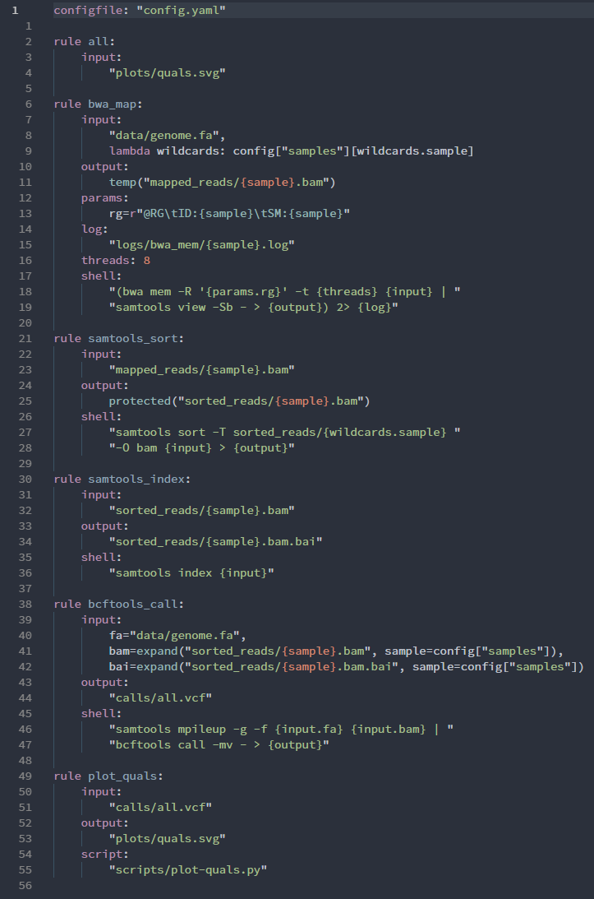

# Snakemake Language Support

Provides basic language support for [Snakemake](https://snakemake.readthedocs.io) files (Snakefile, *.smk).
Feedback, suggestions, and contributions are very welcome!

This project has been started by Peter Alping, and can be considered a fork of [this repository](https://gitlab.com/alping/vscode-snakemake).

## Features

- Syntax definitions based on Python, with added Snakemake keywords
- Language rules based on Python
- Snippets

## Example

<!--
Needs to be published with:
vsce publish --baseContentUrl https://gitlab.com/alping/vscode-snakemake/raw/master
-->

Example taken from [Snakemake documentation](https://snakemake.readthedocs.io/en/stable/tutorial/advanced.html#summary).

## Supported Syntax

Keywords and Functions

- Configurations
  - configfile
  - include
  - localrules
  - onerror
  - onstart
  - onsuccess
  - ruleorder
  - snakefile
  - workdir
- Rules
  - checkpoint
  - rule
  - subworkflow
- Rule Parameters
  - benchmark
  - conda
  - cwl
  - group
  - input
  - log
  - message
  - output
  - params
  - priority
  - resources
  - run
  - script
  - shadow
  - shell
  - singularity
  - threads
  - version
  - wildcard_constraints
  - wrapper
- Functions
  - ancient
  - directory
  - expand
  - pipe
  - protected
  - temp
  - touch
  - unpack

## TODO

- [ ] Indentation rules (really tricky for some reason)
- [ ] Recognize string substitutions: `"command {input}"`
- [ ] Recognize wildcard constraints inside string substitutions: `"{sample,[A-Za-z0-9]+}"`

## Snakemake Support for other Editors

- [Vim](https://github.com/snakemake/snakemake/tree/master/misc/vim)
